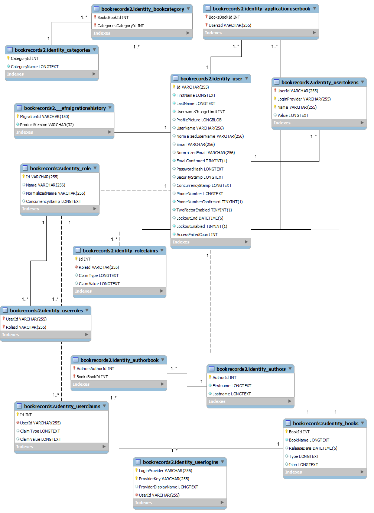

# MVCIdentityBookRecords

Inpdependent project for Developer bootcamp 2022. This Version Uses C# AspNet MVC and Identity Framework. The basic MVC web pages uses Cookie based authentication
and API uses Jwt-token based authentication.
## Github Repository
<a href="https://github.com/Lepito88/MVCIdentityBookRecords" >MVCIdentityBookRecords</a>
# ER-Model

# Configuration
One needs to create user-secrets file to add necessary config strings.
This version Uses currently Local MySql database.
# API Endpoints

Application API Controllers uses following Base_url: https://localhost:7041/api OR http:/localhost:5041/api  
Endpoints are listed as following format: Method: URL

## Authenticate

 - POST: /login
   - Email OR Username
   - Password
 - POST: /register
    - Username
    - Email
    - Password
    - ConfirmPassword
    - Firstname
    - Lastname
 ## Author
 - GET: /author
   - Fetch all authors from database
 - GET: /author/{id}
   - Fetch specific author from database
 - POST: /author
   - Create new author
     - Parameters for POST:
        - Firstname
        - Lastname
 - PUT: /author/{id}
   - Update specific author who has id.
     - Parameters for PUT:
        - Firstname
        - Lastname
 - DELETE: /author/{id}
   - Delete author from database.

 ## ApplicationUser
 ### Requires user to be SuperAdmin

 - GET: /users
   - Fetch all users from database
 - GET: /users/{id}
   - Fetch specific user from database
 - POST: /users
   - Create new user
     - Parameters for POST:
      - Username
      - Email
      - Password
      - ConfirmPassword
      - Firstname
      - Lastname
 - PUT: /users/{id}
   - Update specific user who has id n.
     - Parameters for PUT:
     - UserName
     - FirstName
     - LastName
     - PhoneNumber
 - DELETE: /users/{id}
   - Delete user from database.
 ## Categories
  - GET: /categories
   - Fetch all categories from database
 - GET: /categories/{id}
   - Fetch specific categories from database
 - POST: /categories
   - Create new category
     - Parameters for POST:
        - CategoryId
        - CategoryName
 - PUT: /categories/{id}
   - Update specific category who has id n.
     - Parameters for PUT:
        - CategoryId
        - CategoryName
 - DELETE: /categories/{id}
   - Delete category from database.
 ## Books
  - GET: /books
   - Fetch all books from database
 - GET: /books/{id}
   - Fetch specific book from database
 - POST: /books
   - Create new book
     - Parameters for POST:
        - BookId
        - BookName
        - ReleaseDate
        - Type
        - Isbn
 - PUT: /books/{id}
   - Update specific book with an id of id.
     - Parameters for PUT:
        - BookId
        - BookName
        - ReleaseDate
        - Type
        - Isbn
 - DELETE: /books/{id}
   - Delete book from database.

  ## ERROR CODES USED IN API RESPONSES
### Author service error codes
- A02: Author not found
- A01:
- A03: Unable to Delete author
- A04: No Authors Found
- A05 : Unable to save author

### Book service Error codes
- B01: No Books found
- B02: Book not found
- B03: Unable to delete book
- B04: Unable to update book
- B05: Unable to save book

### Category Service Error Codes
 - C01: No categories found.
 - C02: Category not found
 - C03: Unable to delete category
 - C04: Unable to update category
 - C05: Unable to save Category

### EntityRelationShipManagerService Error codes
- ATB01: Unable to find user
- ATB02: Unable to find book
- ATB03: Unable to find author
- ATB04: Book does not Exist
- ATB05: User does not exist
- ATB06: Book is already added to user
- ATB07: Author is already addded to book
- ATB08: Book does not have author added
- ATB09: Book has not been added to user
- ATB10: Unable to find category
- ATB11: Category is already added to book
- ATB12: Category has not been added to book. Unable to remove.
